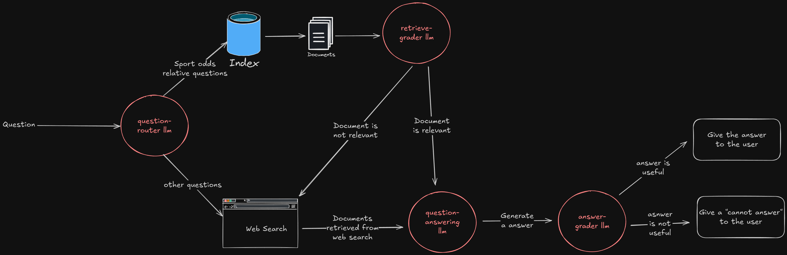

# Self-RAG Sports Betting

## 📌 Project Description  
Self-RAG Sports Betting is an AI-powered retrieval-augmented generation (RAG) system designed to answer sports betting queries efficiently. It routes user questions to either:  
- **A vector database** for retrieving relevant information.  
- **A web search** when the data isn't available in the knowledge base.  

By combining retrieval and generation, the system provides accurate and up-to-date betting insights.

---

## 📊 System Workflow  

The system architecture is shown below:



---

## 🚀 Installation  

To get started with Self RAG Sport Betting, follow these steps:

1. Clone this repository.
2. Navigate to the project directory.
3. Install the required dependencies with `pip`:

```bash
pip install -r requirements.txt
```

## Configuration

You will need those environment variables:

```bash
OPENAI_API_KEY=your_openai_api_key
TAVILY_API_KEY=your_tavily_api_key
```

## Usage

TODO